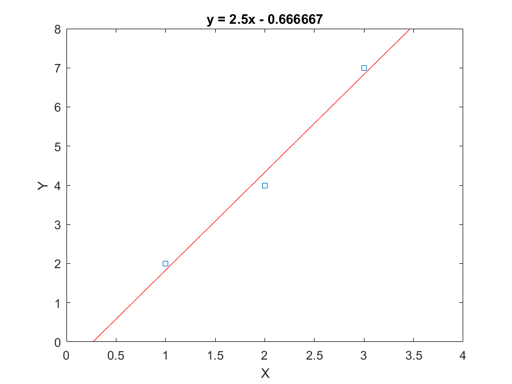

# Julia

Julia is a high-level open-source programming language developed by a group of four at MIT. Julia is a dynamic, high-performance programming language used to perform scientific computing operations. Like the R programming language, Julia is used for statistical computing and data analysis. Julia was developed primarily for the speed of programming. It runs much faster than Python or R. analysis.

## Installing Julia

The instructions which follow are for a Ubuntu (or debian) linux OS. To install, simply run the curl command:

```
curl -fsSL https://install.julialang.org | sh
```
If this does not work because you haven't install Curl, go ahead and do so:

```
sudo apt install curl
```

The installation process will make changes to your ~/.bashrc file - so to see these in effect after installation is completed, you can reload it:

```
source ~/.bashrc
```

Then you can check it works by:

```
julia
```

which will open the interactive julia prompt, which we will not use during this course. Exit this by typing:

```
exit()
```

## Installing Packages in Julia

The Julia ecosystem uses packages, in the same way Python uses packages managed by pip. 

Consider the second example covered in this repository - it uses several packages which need to be installed locally before they can be used. While packages can be managed in the same script as your codes by switching between a package management mode and computation (standard) mode, it's easier to create a Julia script to manage your own particular needs. I've prepared a script to manage installation of these packages - you should execute it before attempting these examples:

```
julia ./J-0-Package-Installation/install.j
```

## J-1 Hello World

Your first Julia code is the standard "Hello World" code, located in folder J-1-Hello-World. From the root directory of this repository, type this to run it:

```
julia ./J-1-Hello-World/main.jl
```

## J-2 Simple Linear Regression

The next Julia code covers a simple regression. The goal is to find a linear function (y = mx + C) which best describes observed data as shown below:

| X   |  Y    |
|-----|-------|
|  1  |  2    |
|  2  |  4    |
|  3  |  7    |


Our goal is to compute the gradient of the line (m, in y = mc+c) and the intercept (c). To perform the regression, run the code:

```
julia ./J-2-Regression/main.jl
```

If you have correctly installed your packages, you should see this output:

```
Creating data frame...
Inside create_data_frame()
DataFrame created:
3×2 DataFrame
 Row │ X      Y
     │ Int64  Int64
─────┼──────────────
   1 │     1      2
   2 │     2      4
   3 │     3      7
Fitting OLS model...
StatsModels.TableRegressionModel{LinearModel{GLM.LmResp{Vector{Float64}}, GLM.DensePredChol{Float64, LinearAlgebra.CholeskyPivoted{Float64, Matrix{Float64}, Vector{Int64}}}}, Matrix{Float64}}

Y ~ 1 + X

Coefficients:
─────────────────────────────────────────────────────────────────────────
                 Coef.  Std. Error      t  Pr(>|t|)  Lower 95%  Upper 95%
─────────────────────────────────────────────────────────────────────────
(Intercept)  -0.666667    0.62361   -1.07    0.4788   -8.59038    7.25704
X             2.5         0.288675   8.66    0.0732   -1.16797    6.16797
─────────────────────────────────────────────────────────────────────────
```

It has returned the things we are interested in:

* The intercept (c) is -0.666667.
* The value of the slope (m) is 2.5.

Hence, the computed equation is y = 2.5x-0.666667. Plotting this together with our points shows the fit:


