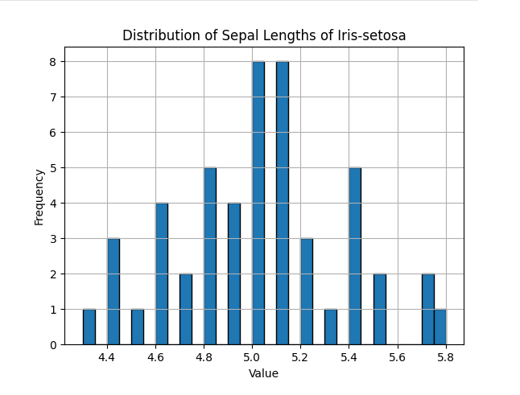

# NCKU-Data-Analysis
Codes and documentation for my course on Data Analysis, using Pandas and Julia.

This material is covered as part of the semester 2 subject "Python資料分析入門" (Introduction to Data Analysis in Python), although (be warned!) there is some Julia covered as part of this course.

## Julia Examples and README file

You can find out more about the Julia examples covered as part of this course [here](./JULIA.md).

## Pandas Examples

The examples using Pandas for data loading, manipulation and analysis are shown below.

### P-1 Hello World

This python script:

* Loads the Iris dataset in the /Data directory into a Pandas dataframe,
* Shows the first few rows of the dataframe.

To run this - navigate to the folder first, and then run the python script. From the root of this directory:

```
cd P-1-Hello-World
python main.py
```

If working, this should be the output:

```
Loading data from ./../Data/iris.data
Initial Data:
   SepalLength  SepalWidth  PetalLength  PetalWidth        Class
0          5.1         3.5          1.4         0.2  Iris-setosa
1          4.9         3.0          1.4         0.2  Iris-setosa
2          4.7         3.2          1.3         0.2  Iris-setosa
3          4.6         3.1          1.5         0.2  Iris-setosa
4          5.0         3.6          1.4         0.2  Iris-setosa
```

### P-2 Extract Data

This python script:

* Loads the Iris dataset in the /Data directory into a Pandas dataframe,
* From the Iris dataframe, creates a new dataframe containing a subset of the Iris dataframe,
* Saves the subset to file (CSV)

To run this:

```
P-2-Extract-Data
python main.py
```

If this worked, you'll see this output:

```
Loading data from ./../Data/iris.data
Initial Data:
   SepalLength  SepalWidth  PetalLength  PetalWidth        Class
0          5.1         3.5          1.4         0.2  Iris-setosa
1          4.9         3.0          1.4         0.2  Iris-setosa
2          4.7         3.2          1.3         0.2  Iris-setosa
3          4.6         3.1          1.5         0.2  Iris-setosa
4          5.0         3.6          1.4         0.2  Iris-setosa
Number of Iris-setosa flowers: 50
Type of setosa_data: <class 'pandas.core.frame.DataFrame'>
Data saved to setosa_data.csv
```

## P-3 Simple Graphing and Analysis

In addition to topics covered in P-1 and P-2, this code demonstrates:

* How to create a histogram of the sepal lengths of Iris Setosa flowers from the Iris set.
* How to perform simple mathematics (mean and standard deviation calculation) on a column in a dataframe.

To run, navigate to the folder from the root of this repository and run:

```
cd P-3-Data-Graphing
python main.py
```

If this worked, you should see the histogram appear:



You should also see the mean and standard deviation of the sepal lengths shown in the command line:

```
Loading data from ./../Data/iris.data
Mean Sepal Length of Iris-setosa: 5.006
Standard Deviation of Sepal Length of Iris-setosa: 0.35248968721345136
```

## P-4 3D Scatter Plots

This code builds on the previous examples, and also:

* Loads two different flower types from the Iris set into two different dataframes,
* Creates a scatter plot of 3 of the properties (SepalLength, SepalWidth and PetalLength) for the two types.

To run:

```
cd P-4-Scatter-Plot
python main.py
```

If this runs properly, you'll see this graph appear:


## P-5 Dropping Data

This demonstration focuses on the Adult dataset from UCI, found [here](https://archive.ics.uci.edu/dataset/2/adult). This data is a good demonstration set because there are columns with missing data which we might want to move. This is precisely the point of this activity:

* This code identifies rows which have data missing, and then drops them from the dataframe.

If run correctly, you should see output containing this:

```
Number of rows before dropping missing values: 32561
Dropping 1843 rows with missing Occupation values
Number of rows after dropping missing values: 30718
```

This code also demonstrates:
* Getting the column names out of the dataframe,
* Trimming spaces out of data contained in columns.

## P-6 JSON data from HTTP sources

This code demonstrates:
* Fetching data from a HTTP source instead of a CSV source
* Minor processing of JSON data before saving into a pandas dataframe
* Perform some minor counting work on records obtained.

More information about the requests library can be found [here](https://requests.readthedocs.io/en/latest/). Essentially, REST-APIs (Representational State Transfer APIs) form the core of modern internet communications and website designs. Through REST-APIs, we can:
* Fetch data from online servers for a range of applications,
* Using data from online servers, render web pages,
* Manage authorized access to data, creation of data in servers etc.

This code hides a lot of the complexity around HTTP - this will be covered in class.

To run the code - first, make sure you have internet access. This python script reaches out to a server (hosted in AWS) to fetch data. Then, navigate to the root directory of the cloned repository and run:

```
cd P-6-HTTP-Data
python main.py
```

This will produce this output:

```
User 29c4f681-4baa-4f68-83af-120a5ec1210c has 3 rules in the combined dataframe.
User c9544cb4-0064-49b2-8ee8-6a8e2706bcaf has 3 rules in the combined dataframe.
User 75adfe1d-2f27-4f4c-9cf4-c17ed2fdc4fe has 3 rules in the combined dataframe.
User 01a16664-05bb-4585-a0b2-96d4e2835c7c has 1 rules in the combined dataframe.
User c0fe91a7-cfc9-4527-967b-4b9b9e1ed730 has 3 rules in the combined dataframe.
User 84e35798-790c-4a2f-ad95-1644e0d07c60 has 1 rules in the combined dataframe.
User e0ca46d4-d159-4f20-ac8b-9dcd03c024c0 has 3 rules in the combined dataframe.
```

A CSV file will also be produced holding the resulting data contained in the dataframe.

